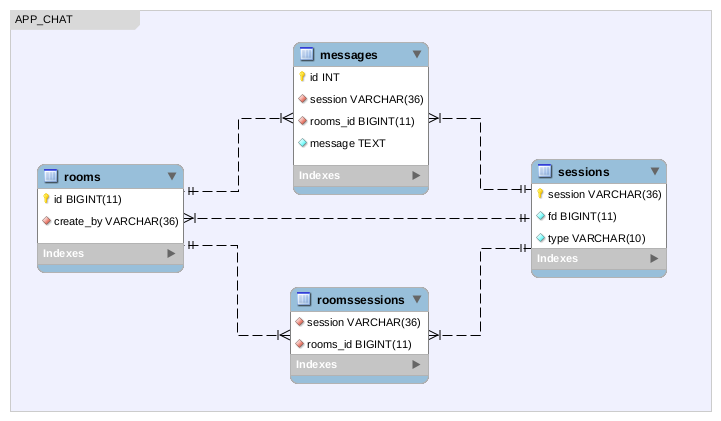

# CHAT_APP

----------------------------------------------------
### Como o projetos esta dividido?

O projeto esta divido em 3 partes:
- Ambiente docker
- Ambiente PHP
- Integração com o sistema Swoole
----------------------------------------------------
### Estrutura do Ambiente DOCKER
``` sh
# https://hub.docker.com/u/facchin

.
└── facchin/devbase-base:ubuntu-16.04
    └── facchin/devbase-supervisor:ubuntu-16.04
        └── facchin/devbase-bootstrap:ubuntu-16.04
   

3 imagens uma dependente da outra, sendo a imagem 'devbase-base' utilizada
pra o Ambiente PHP
```
----------------------------------------------------
### SETUP DO PROJETO
``` sh
$ mkdir chat_app
$ cd chat_app
$ git clone https://github.com/patrickfacchin/chat_app.git .
$ composer install
$ cd .docker
$ docker-compose build
$ docker-compose up -d
$ mysql -uroot -proot -h127.0.0.1 < mysql-dump/Dump.sql

```
Após acessar http://localhost:9001/ e restartar o serviço 'php-server'

----------------------------------------------------
### AVALIAR FUNCIONALIDADE
- Abrir ao mesmo tempo as urls http://localhost/ e http://localhost/atendente
- Enviar mensagem pelo chat do cliente e do atendente

----------------------------------------------------
### DER


----------------------------------------------------
### Estrutura de arquivos principais do projeto corrente

``` sh
# Host system
$ tree
.
├── app
│   ├── Core
│   │   ├── Db.php
│   │   └── Model.php
│   ├── Models
│   │   ├── Message.php
│   │   ├── Room.php
│   │   ├── RoomsSession.php
│   │   └── Session.php
│   └── WebsocketServer.php
├── composer.json
├── der
│   ├── app.mwb
│   └── der.png
├── LICENSE
├── public
│   ├── css
│   │   ├── comp_chat.css
│   │   └── comp_chat_suport.css
│   ├── index.php
│   ├── js
│   │   ├── comp_chat.js
│   │   ├── comp_chat_suport.js
│   │   └── ws.js
│   ├── sounds
│   │   ├── chime.mp3
│   │   └── door.mp3
│   └── views
│       ├── atendente.html
│       ├── chat.html
│       ├── home.html
│       └── suport.html
├── README.md
└── server.php

```
----------------------------------------------------
### Detalhes do Ambiente DOCKER
- Todos os códigos fontes estão disponiveis em: https://github.com/patrickfacchin/devbase
- Após os 'push' no git, as imagens no hub.docker são geradas automaticamente
----------------------------------------------------

